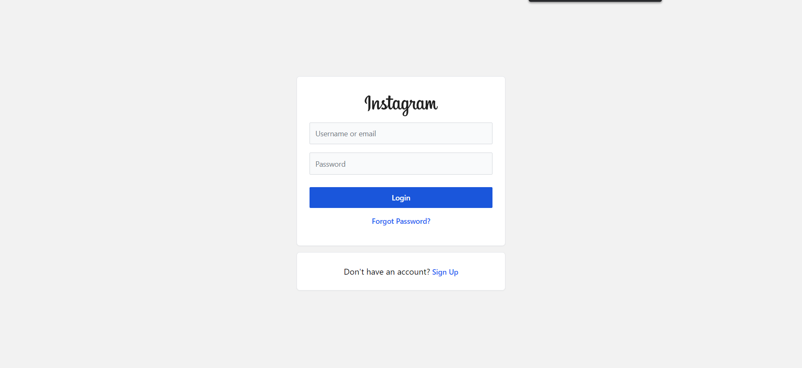
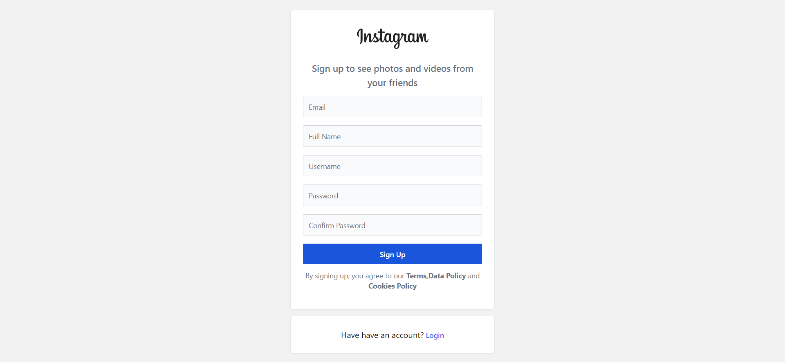
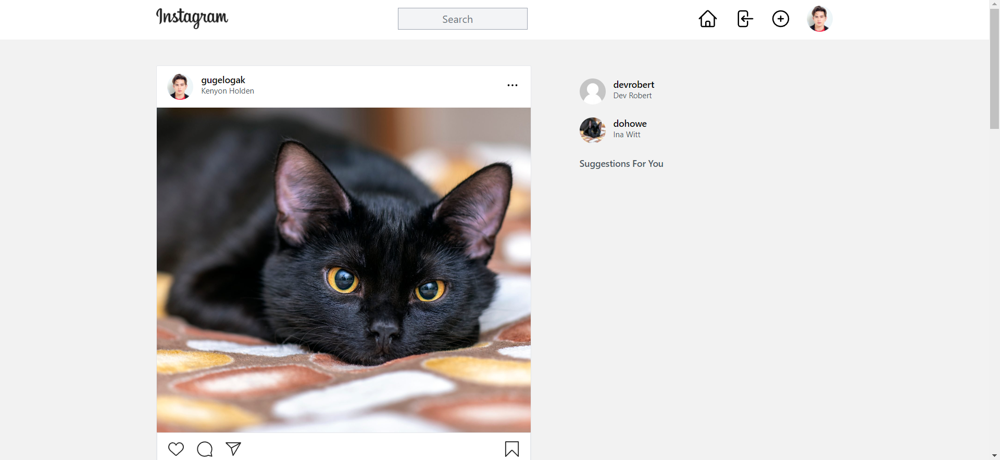
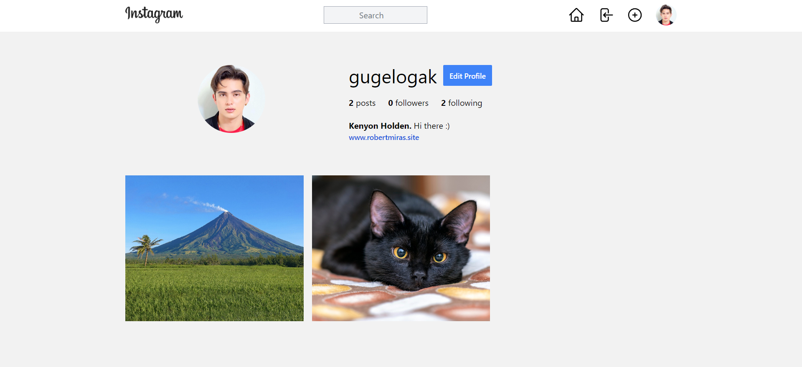
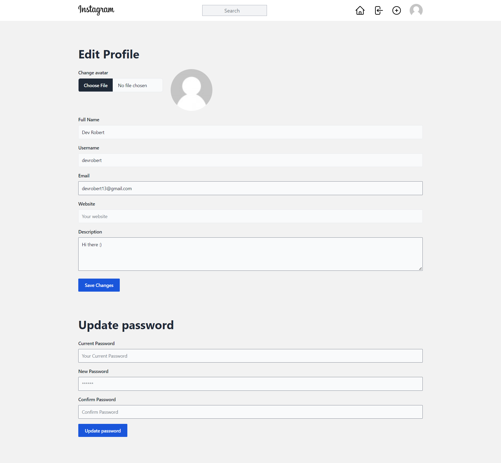
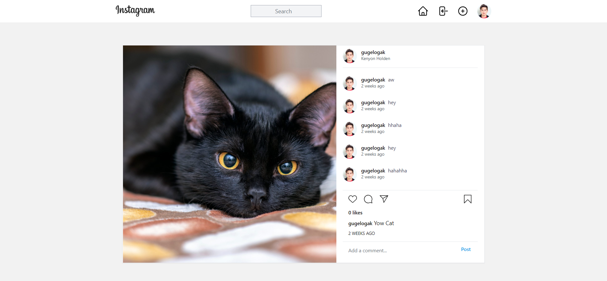
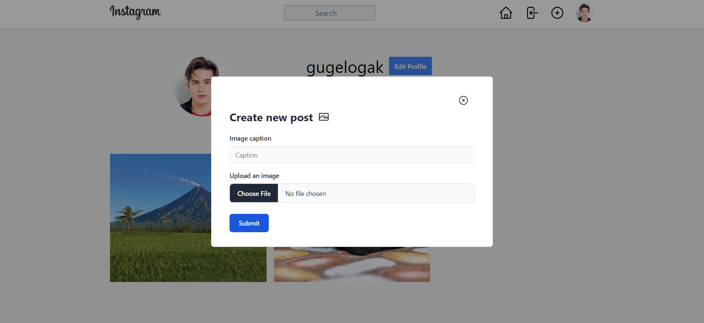

Instagram Clone built using Laravel and VueJS with Vite.

 
Screenshots:

Login:

Register:

News Feed:

Profile:

Edit Profile:

Post and Comment:

Add Post:

 
For the VueJS/Front-End Code:
<code>
https://github.com/mirasrobert/instagram-vue
</code>
